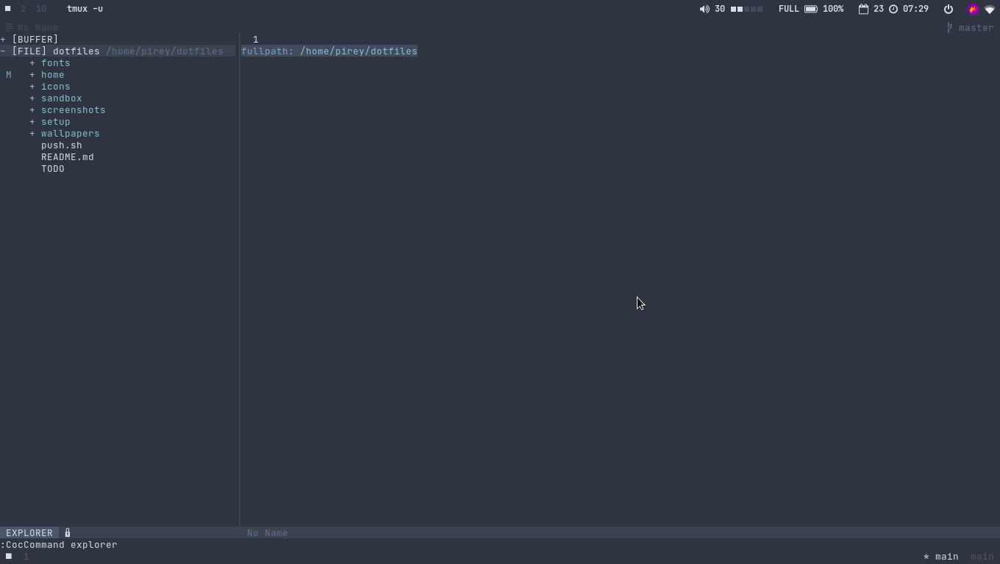
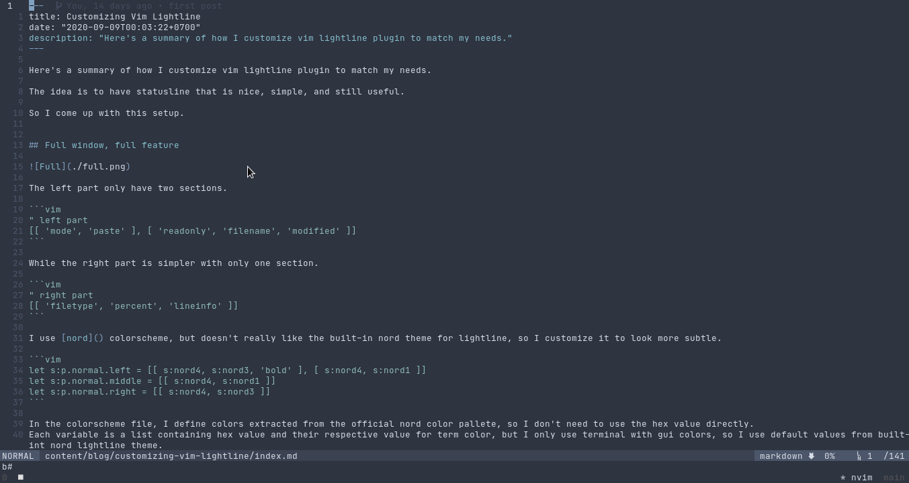
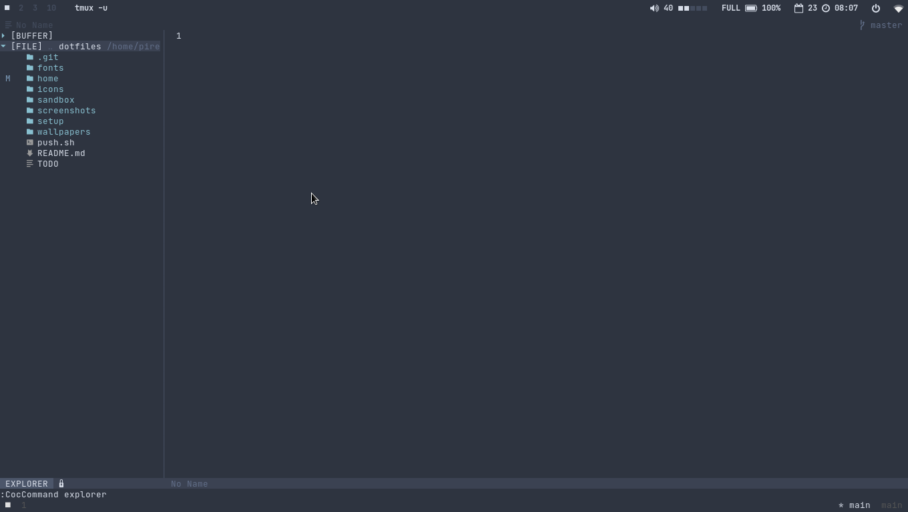
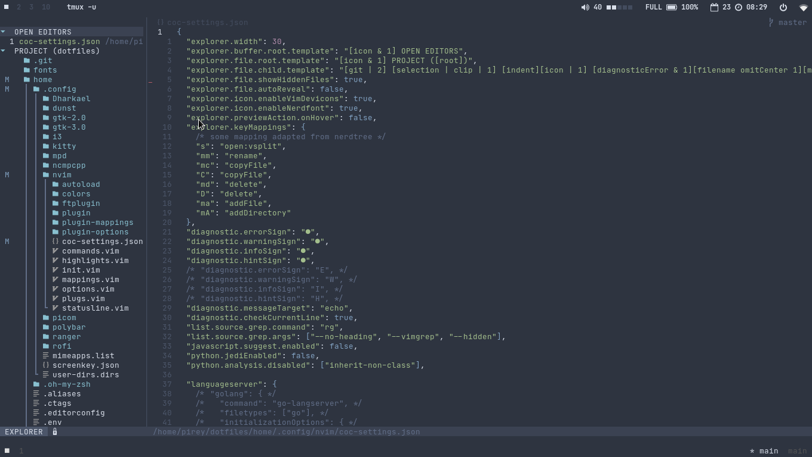

Coc explorer is a [coc.nvim](https://github.com/neoclide/coc.nvim/wiki/Using-coc-extensions) extension that tries to mimic the file explorer feature of vscode.

Here's how it looks by default.



To make adjustment, we can open coc config file using `:CocConfig` command and specify config option within `explorer` field.

The first thing I want to change is the explorer width, I think its too wide.

```
"explorer.width": 30
```

The next thing is to tell it to display hidden files, because I work with a lot of dotfiles.

```
"explorer.file.showHiddenFiles": true
```

When we open coc explorer, by default it will navigate to currently opened file in the tree.



I'm not really like the behaviour, so I disable it.

```
"explorer.file.autoReveal": false
```

The popup window is also distracting rather than helpful, so I disable it also.

```
"explorer.previewAction.onHover": false
```

I'd like to display some nice font icon, I'm using both nerdfont and devicons.

```
"explorer.icon.enableVimDevicons": true
"explorer.icon.enableNerdfont": true
```




By default, coc explorer render ridiculous amount of whitespace after filename, of course I'm getting rid of that.

```
"explorer.file.child.template": "[git | 2] [selection | clip | 1] [indent][icon | 1] [diagnosticError & 1][filename omitCenter 1][modified][readonly] [linkIcon & 1][link growRight 1 omitCenter 5]"
```

Next, I tidy up the label a bit.

```
"explorer.buffer.root.template": "[icon & 1] OPEN EDITORS"
"explorer.file.root.template": "[icon & 1] PROJECT ([root])"
```

I also still use some mappings that I use in nerdtree.

```
"explorer.keyMappings": {
    "s": "open:vsplit",
    "mm": "rename",
    "mc": "copyFile",
    "C": "copyFile",
    "md": "delete",
    "D": "delete",
    "ma": "addFile",
    "mA": "addDirectory"
}
```

## Final result



Full config:

```
"explorer.width": 30,
"explorer.buffer.root.template": "[icon & 1] OPEN EDITORS",
"explorer.file.root.template": "[icon & 1] PROJECT ([root])",
"explorer.file.child.template": "[git | 2] [selection | clip | 1] [indent][icon | 1] [diagnosticError & 1][filename omitCenter 1][modified][readonly] [linkIcon & 1][link growRight 1 omitCenter 5]",
"explorer.file.showHiddenFiles": true,
"explorer.file.autoReveal": false,
"explorer.icon.enableVimDevicons": true,
"explorer.icon.enableNerdfont": true,
"explorer.previewAction.onHover": false,
"explorer.keyMappings": {
  /* some mapping adapted from nerdtree */
  "s": "open:vsplit",
  "mm": "rename",
  "mc": "copyFile",
  "C": "copyFile",
  "md": "delete",
  "D": "delete",
  "ma": "addFile",
  "mA": "addDirectory"
}
```
